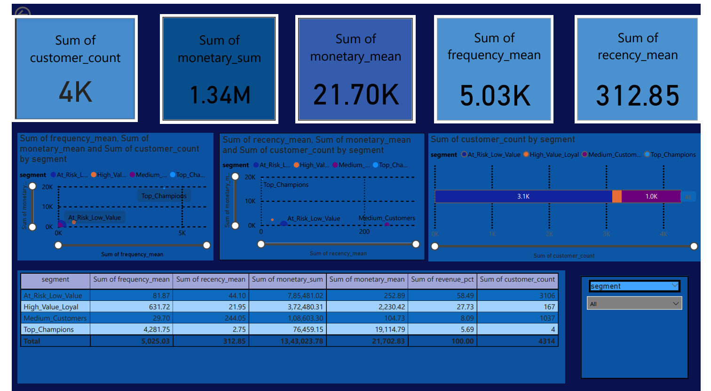

## **Chandana's Customer Segmentation Dashboard (RFM Analysis)**

## **Problem Statement**
Businesses need to identify and segment customers based on purchasing behavior to improve retention and maximize revenue. This project applies RFM analysis and clustering to group customers into actionable segments for targeted marketing strategies.

## **Dashboard Preview**

## **Steps: From Data to Dashboard in Power BI**

1.Loaded the cleaned dataset (RFM_SegmentSummary_clean.csv) into Power BI Desktop.

2.Cleaned and transformed data using Power Query (renamed, removed nulls, fixed datatypes).

3.Created calculated measures (recency, frequency, monetary, customer count, revenue).

4.Built KPI cards, bar charts, scatter plots, and tables for RFM insights.

5.Added slicers and interactivity for dynamic filtering by customer segments.

6.Designed dashboard layout with clear theme and visuals.

7.Exported final dashboard to PDF and saved as .pbix for sharing.

## 📊 Key Insights

1. **Customer Segmentation**  
   - **Visual**: *KPI Cards + Slicer (Segment)*  
   - Customers are divided into groups (*Champions, At Risk, Low-Value, etc.*) using RFM scores. KPI cards dynamically update based on the selected segment.  

2. **Revenue Concentration**  
   - **Visual**: *Bar Chart (Monetary by Segment)*  
   - Shows that *Champions* contribute the highest total revenue (~20% customers → ~60% revenue).  

3. **Retention Risks**  
   - **Visual**: *Table (RFM Summary by Segment)*  
   - Large portion of customers fall into *At Risk* and *Low-Value* categories, indicating churn potential.  

4. **Loyal Customers Opportunity**  
   - **Visual**: *Scatter Plot (Recency_mean vs Monetary_mean)*  
   - Medium-frequency, medium-to-high spending customers cluster around the middle, suggesting potential for upsell/loyalty programs.  

5. **Customer Distribution**  
   - **Visual**: *Clustered Bar/Column Chart (Count of Customers by Segment)*  
   - Clear view of customer distribution across RFM segments, highlighting which groups dominate.  

6. **Business Recommendations**  
   - **Visual**: *All visuals together (Dashboard Overview)*  
   - Dashboard helps management decide where to invest in retention, upselling, and reactivation campaigns.  

